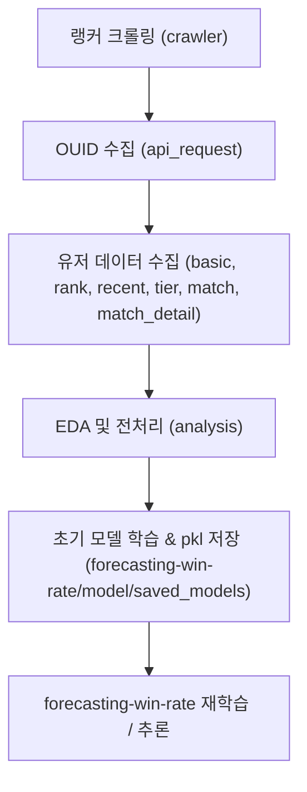

# 🎯 Sudden Attack Match Win Rate Forecasting

넥슨 Open API와 웹 크롤링을 활용하여 서든어택 랭커 데이터를 수집하고,  
분석을 통해 **가장 많이 플레이되는 모드(퀵매치 클랜전)** 를 선정, 해당 모드에서의 **승리 확률 예측 모델**을 구축한 프로젝트 

최종적으로 학습된 모델을 `.pkl`로 저장하여, **`forecasting-win-rate`**에서 재학습과 추론을 반복 수행할 수 있도록 설계하였음

---

## 1. 프로젝트 개요

1. **데이터 준비·분석 단계** *(`crawler`, `api_request`, `collected_data`, `analysis`)*  
   - 랭커 닉네임 수집 → API 데이터 수집 → EDA → 전처리(df_final 생성) → 초기 모델 학습 및 저장
   - `forecasting-win-rate`에서 학습/추론을 수행하기 위한 데이터와 근거를 생성

2. **메인 파이프라인 단계** *(`forecasting-win-rate`)*  
   - `.pkl` 모델을 활용하거나 재학습
   - 새로운 매치 데이터를 기반으로 실시간 또는 배치 추론 수행

---

## 2. 수행 순서

### 2-1) **랭커 닉네임 수집 (crawler)**
- 서든어택 랭킹 페이지 크롤링 → 랭커 826명 닉네임 확보 (`nickname.csv`)

### 2-2) **API 데이터 수집 (api_request)**
- 닉네임으로 OUID 조회
- OUID로 `basic`, `rank`, `recent`, `tier`, `match`, `match_detail` API 호출
- 모든 응답 JSON을 `collected_data/*_json`에 저장

### 2-3) **데이터 분석 및 전처리 (analysis)**
- EDA를 통해 **퀵매치 클랜전** 모드를 분석 대상으로 선정
- `utils/feature_engineering.py` 실행  
  → match-detail + API 데이터 병합  
  → 정보 누설 방지 피처 제거  
  → 타겟 컬럼 생성 (`승=1`, `무/패=0`)
- `df_final.csv` 생성 (모델 학습용 데이터셋)
- 초기 모델(RandomForest, XGBoost) 학습 → `.pkl`로 저장

### 2-4) **메인 학습/추론 (forecasting-win-rate)**
- 저장된 `.pkl` 모델로 새로운 데이터 예측
- 필요 시 재학습 진행
- 예측 결과와 피처 중요도 시각화 저장

---

## 3. 폴더 구조
```
NEXON_API/
├── crawler/ # 랭커 닉네임 크롤링
├── api_request/ # Nexon Open API 호출 스크립트
├── collected_data/ # API 응답 원본 JSON 및 매핑 CSV
├── analysis/ # 전처리, EDA, 초기 모델 학습/평가 결과
├── forecasting-win-rate/ # 메인 학습/추론 파이프라인
```

---

## 4. 작업 플로우


    E --> F["forecasting-win-rate 재학습 / 추론"]


## 3. 폴더 구조

