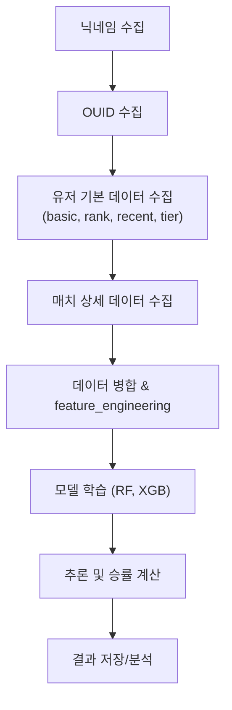

# 🎯 Sudden Attack Match Win Rate Forecasting


## 환경 설치 (Setup)
```bash
# 1. 저장소 클론
git clone https://github.com/username/forecasting-win-rate.git
cd forecasting-win-rate

# 2. 가상환경 생성 & 활성화
conda create -n sa_forecast python=3.10 -y
conda activate sa_forecast

# 3. 필수 라이브러리 설치
pip install -r requirements.txt

# 4. 실행
python main.py
```

## 1. 프로젝트 개요
**넥슨 Open API**를 활용하여 서든어택 유저 데이터를 수집하고  
경기 전/후 정보를 기반으로 **승리 확률을 예측하는 머신러닝 모델**을 구축하는 것을 목표로 함

---

## 2. 작업 목적
- **실시간 경기 승률 예측**: 경기 시작 전 데이터만으로 팀별 승리 확률을 산출.
- **게임 데이터 분석 역량 강화**: API 데이터 수집, 전처리, 모델 학습 및 추론까지의 전체 파이프라인 구축.
- **비표준 데이터 플로우 적용**: `data_eda` 단계에서 생성된 `pkl` 파일을 재활용하여 모델 재학습 및 추론.

---

## 3. 폴더 및 파일 구조

```
forecasting-win-rate/
├── analysis/ # 분석 및 시각화 관련 코드/노트북
├── api_request/ # Nexon API 요청 스크립트 (basic, rank, recent, tier, match_detail)
├── collected_data/ # API 응답 저장(JSON/CSV)
├── model/ # 학습·추론 코드 및 저장된 모델
├── utils/ # 유틸리티 함수 (feature_engineering 포함)
├── api_key.txt # API 키 (gitignore 적용 권장)
├── main.py # 전체 실행 엔트리 포인트
├── requirements.txt # 의존성 패키지 목록
└── README.md # 프로젝트 설명 문서
```


---

## 4. 주요 폴더 설명

### 📂 `analysis/`
- 모델 성능 비교, 피처 중요도 시각화, 예측 결과 분석 등
- Jupyter Notebook 기반 분석 코드 포함

### 📂 `api_request/`
- 넥슨 Open API 호출 모듈
- 각 API(basic, rank, recent, tier, match_detail)에 대해 별도 스크립트 작성
- `requests`와 `tqdm`을 활용한 비동기적 수집 구조

### 📂 `collected_data/`
- API 응답 저장 디렉토리
- `user_name`, `match_id` 단위로 저장된 JSON/CSV
- 추후 전처리 및 피처 엔지니어링의 입력 데이터

### 📂 `model/`
- **train_models.py**: `RandomForest`, `XGBoost` 기반 모델 학습 및 저장
- **inference.py**: 저장된 모델을 불러와 신규 경기 데이터 승률 예측
- Stratified K-Fold + GridSearchCV로 하이퍼파라미터 튜닝 적용

### 📂 `utils/`
- **feature_engineering.py**:  
  - `match_detail`과 병합 데이터(`merged`)를 기반으로 ML 입력용 데이터셋 생성
  - 승/무/패 여부 컬럼(`is_win`, `is_draw`, `is_loss`) 생성
  - `['user_name', 'match_id']` 기준 중복 제거
  - 모델 학습용 최종 DataFrame(`df_final`) 반환
- 공통 함수, 데이터 로딩, 전처리 로직 포함

---

## 5. 작업 플로우

